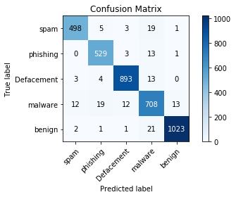
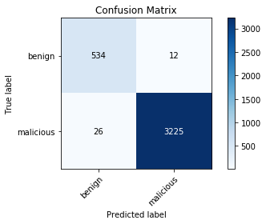
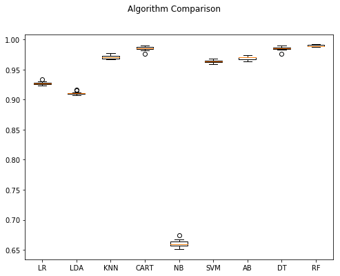
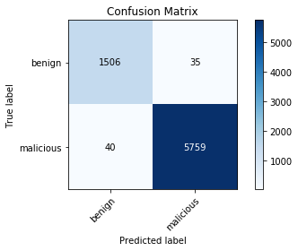

# Machine Learning Models to Detect and Classify Malicious URLs

- Test

## Introduction

This research project compares the accuracies of varioius machine algorithms and deep learning frameworks in detecting and classifying malicious URLs using lexcial features.

Experiments results show that Random Forest, an ensemble-based classifier, not only outperformed 8 other traditional machine learning classifiers but also some deep neural network models generated by cutting-edge popular frameworks such as
TensorFlow and PyTorch in detecting and classifying malicious URLs using lexical features.

## Dataset

-   downloaded from: https://www.unb.ca/cic/datasets/url-2016.html
-   run Baseline-Experiments.ipynb jupyter notebook to download dataset using provided Bash script

## Data Cleanup

-   dropped samples and attributes with NaN, Infifinity and mising values
-   removed whitespaces from column/attribute names

## Dataset Summary

-   labeled 5 URL types with total 36,707 samples (before cleanup)
-   consists of 79 lexical features extracted from URLs
-   table below shows original sample counts (Total) and New Totals (after data cleanup)
-   Total (Dropping NaN Rows) - remaining total samples after dropping samples with NaN values
    -   ~17K rows were dropped
-   Total (Dropping NaN Cols) - remaining total samples after dropping columns/attributes with NaN values
    -   7 attributes are dropped as a result with total 72 attributes remaining

| Dataset | URL Type   |  Total | Dropping NaN Rows | Dropping NaN Cols |
| ------- | ---------- | -----: | ----------------: | ----------------: |
| All.csv | benign     |  7,781 |             2,709 |             7,781 |
|         | defacement |  7,930 |             2,477 |             7,930 |
|         | malware    |  6,712 |             4,440 |             6,711 |
|         | phishing   |  7,586 |             4,014 |             7,577 |
|         | spam       |  6,698 |             5,342 |             6,698 |
|         | malicious  | 28,926 |            16,273 |            28,916 |

## Machine Learning Algorithms

-   perfomance results using various machine learning algorithms and deep learning frameworks are compared
-   authors of the dataset[1] have evaluated 3 classifiers
    -   C4.5 (Decision Tree)
    -   KNN (K-Nearest Neighbors)
    -   RF (Random Forest)
    -   RF achieved the best overall results
        -   0.97 Precision and 0.97 Recall on Multi-class
        -   ~ 0.99 Precision and 0.99 Recall on (Single-class)
-   we evaluate 9 ML classifiers provided in sci-kit learn framework
    1.  Logistic Regression (LR)
    -   Linear Discriminant Analysis (LDA)
    -   K-Nearest Neighbors (KNN)
    -   Classification and Regression Trees (CART)
    -   Gaussian Naive Bayes (NB)
    -   Support Vector Machines (SVM)
    -   Random Forest (RF)
    -   Decision Tree (DT)
    -   Ada Boost (AB)
-   2 linear classifiers (LR and LDA)
-   5 nonlinear (KNN, CART, NB, SVM, and DT)
-   2 Ensemble-based (RF, AB)

## Deep Learning Frameworks

### fast.ai & PyTorch

-   fast.ai provides high level Python API wrapper over PyTorch with the goal of making deep learning easier to use
-   PyTorch is an open-source Python version of Torch machine learning framework developed by Facebook
-   PyTorch uses dynamic computational graphs (a.k.a. Define-by-Run approach) which let you process variable-length inputs and outputs
-   network is defined dynamically via the actual forward computation

### Keras, TensorFlow & Theano

-   Keras is an open-source high-level neural networks API, written in Python and cabable of running on top of TensorFlow, CNTK, or Theano
-   Keras allows for easy and fast prototyping
    -   through user friendliness, modularity, and extensibility
    -   runs seamlessly on CPU and GPU
-   we experimented with TensorFlow and Theano as backend
-   TensorFlow is an open-source ML framework developed by Google
-   TensorFlow uses static computational graphs (a.k.a. Define-and-Run approach)
-   Theano is no longer maintained

## Model Evaluations

-   use 10-fold cross validation to estimate accuracy results
-   split dataset into 10 parts, train on 9 and test on 1 and repeat for all combination of train-test splits
-   calculate the average accuracy

## Experiments and Results

### Multi-class Classification (All.csv)

-   classification of URL types (benign, malware, spam, phishing, defacement)

### Machine Learning Algorithm Results

#### Results on Dataset after Dropping NaN Rows

-   Comparision of Algorithms using Box plot

    

-   Validation Results from Best Classifer (Random Forest)

-   Confusion Matrix

    

-   Classification Report:

    |              | precision | recall | f1-score | support |
    | ------------ | --------- | -----: | -------: | ------: |
    | defacement   | 0.97      |   0.95 |     0.96 |     526 |
    | benign       | 0.95      |   0.97 |     0.96 |     546 |
    | malware      | 0.98      |   0.98 |     0.98 |     913 |
    | phishing     | 0.91      |   0.93 |     0.92 |     764 |
    | spam         | 0.99      |   0.98 |     0.98 |    1048 |
    |              |           |        |          |         |
    | accuracy     |           |        |     0.96 |    3797 |
    | macro avg    | 0.96      |   0.96 |     0.96 |    3797 |
    | weighted avg | 0.96      |   0.96 |     0.96 |    3797 |

#### Results on Dataset after Dropping NaN Columns

-   Comparision of Algorithms using Box-plot

    

-   Validation Results from Best Classifer (Random Forest)

-   Confusion Matrix

    

-   Classification Report:

```
              precision    recall  f1-score   support

  Defacement       0.98      0.98      0.98      1594
      benign       0.97      0.98      0.98      1541
     malware       0.99      0.98      0.98      1367
    phishing       0.95      0.95      0.95      1523
        spam       0.99      0.97      0.98      1315

    accuracy                           0.97      7340
   macro avg       0.97      0.97      0.97      7340
weighted avg       0.97      0.97      0.97      7340
```

### Deep Learning Framework Results

| Framework        | CPU Accuracy (%) | GPU Accuracy (%) | TPU Accuracy (%) |
| ---------------- | ---------------: | ---------------: | ---------------: |
| Fast.AI          |            97.08 |            97.23 |            97.26 |
| Keras-TensorFlow |            96.37 |            95.79 |            95.60 |
| Keras-Theano     |               \* |               \* |               \* |

### Binary-class Classification (All.csv)

-   re-labeled defacement, malware, phishing, spam, defacement as malicious type (1) and benign as 0
-   detecting malicious URLs (malicious Vs benign)

### Machine Learning Algorithm Results

#### Results on Dataset after Dropping NaN Rows

-   Comparision of Algorithms using Box plot

    

-   Validation Results from Best Classifer (Random Forest)

-   Confusion Matrix

    

-   Classification Report:

```
              precision    recall  f1-score   support

      benign       0.95      0.98      0.97       546
   malicious       1.00      0.99      0.99      3251

    accuracy                           0.99      3797
   macro avg       0.97      0.99      0.98      3797
weighted avg       0.99      0.99      0.99      3797
```

#### Results on Dataset after Dropping NaN Columns

-   Comparision of Algorithms using Box-plot

    

-   Validation Results from Best Classifer (Random Forest)

-   Confusion Matrix

    

-   Classification Report:

```
              precision    recall  f1-score   support

      benign       0.97      0.98      0.98      1541
   malicious       0.99      0.99      0.99      5799

    accuracy                           0.99      7340
   macro avg       0.98      0.99      0.98      7340
weighted avg       0.99      0.99      0.99      7340
```

### Deep Learning Framework Results

| Framework        | CPU Accuracy (%) | GPU Accuracy (%) | TPU Accuracy (%) |
| ---------------- | ---------------: | ---------------: | ---------------: |
| Fast.AI          |            98.83 |            98.62 |            98.73 |
| Keras-TensorFlow |            98.62 |            98.70 |            98.79 |
| Keras-Theano     |               \* |               \* |               \* |

# References

1.  Mohammad Saiful Islam Mamun, Mohammad Ahmad Rathore, Arash Habibi Lashkari, Natalia Stakhanova and Ali A. Ghorbani, "Detecting Malicious URLs Using Lexical Analysis", Network and System Security, Springer International Publishing, P467-482, 2016

-   Your First Machine Learning Project in Python Step-by-Step - https://machinelearningmastery.com/machine-learning-in-python-step-by-step/
-   Define-by-Run - https://docs.chainer.org/en/stable/guides/define_by_run.html
-   TensorFlow: Static Graphs - https://pytorch.org/tutorials/beginner/pytorch_with_examples.html
-   Home - Keras Documentation - https://keras.io/
-   TensorFlow | TensorFlow - https://www.tensorflow.org/
